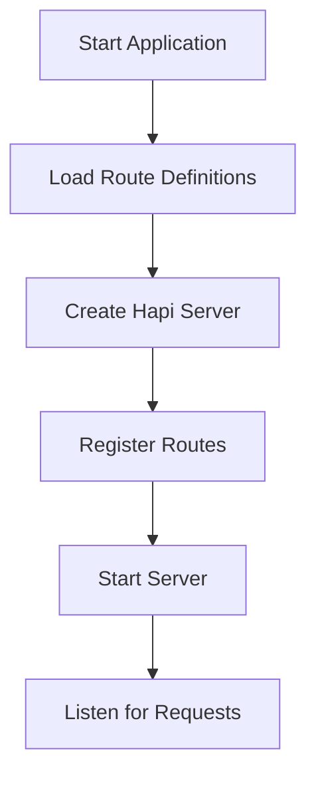
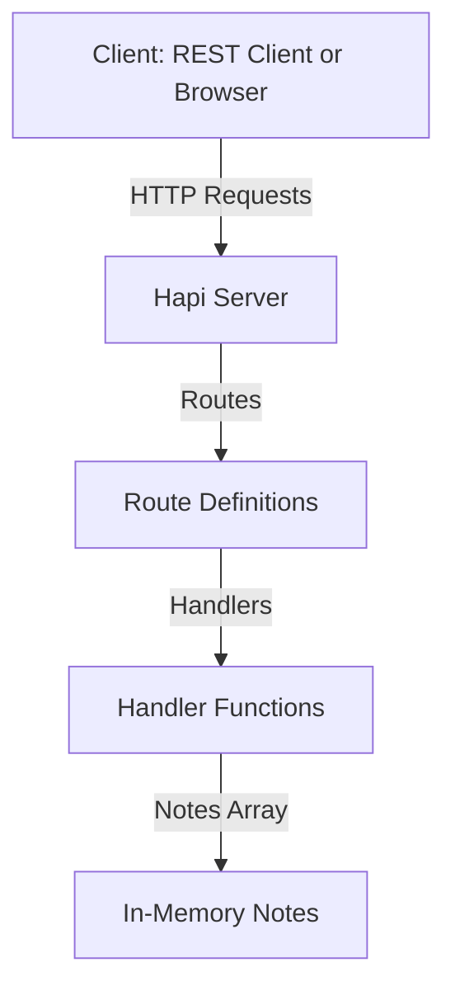

# 📒 Notes App Documentation

This documentation covers all code files in a simple notes application built with Node.js, Hapi, and Bootstrap. The backend provides a RESTful API for note management. Below, you'll find detailed explanations, code flows, and interactive API blocks for every endpoint.

---

## notes.js

This file acts as the in-memory datastore for all notes.

### Purpose

- Holds all note objects in a single array.
- Exports the array for use in other modules.

### Implementation

```js
const notes = [];
module.exports = notes;
```

**Explanation:**
- The `notes` array holds note objects.
- As the app runs, handlers mutate this array directly.

---

## routes.js

This file defines all available API endpoints and connects them to their request handlers.

### Purpose

- Centralizes route definitions for the Hapi server.
- Maps HTTP methods and paths to handler functions.

### Implementation

```js
const {
  addNoteHandler,
  getAllNoteHandler,
  getByIdHandler,
  editByIdHandler,
  deleteByIdHandler,
} = require('./handler');

const routes = [
  { method: 'POST', path: '/notes', handler: addNoteHandler },
  { method: 'GET', path: '/notes', handler: getAllNoteHandler },
  { method: 'GET', path: '/notes/{id}', handler: getByIdHandler },
  { method: 'PUT', path: '/notes/{id}', handler: editByIdHandler },
  { method: 'DELETE', path: '/notes/{id}', handler: deleteByIdHandler },
];

module.exports = routes;
```

**Key Points:**
- Each route object specifies a method, path, and handler.
- Path parameters use curly braces (e.g., `{id}`).

---

## server.js

This file configures and starts the Hapi server.

### Purpose

- Sets up the server’s host, port, and CORS policy.
- Registers all routes.
- Starts the HTTP server.

### Implementation

```js
const Hapi = require('@hapi/hapi');
const routes = require('./routes');

const init = async () => {
  const server = Hapi.server({
    port: 3000,
    host: 'localhost',
    routes: {
      cors: {
        origin: ['*'],
      },
    },
  });

  server.route(routes);

  await server.start();
  console.log(`Server berjalan pada ${server.info.uri}`);
};

init();
```

**Highlights:**
- CORS is enabled for all origins (`'*'`).
- All routes are loaded from `routes.js`.
- Server auto-starts on run.

#### Server Initialization Flow



---

## handler.js

This file contains all the logic for handling note-related HTTP requests.

### Purpose

- Implements all CRUD operations for notes.
- Returns structured API responses.

### Core Functions

| Function           | Purpose                                   |
|--------------------|-------------------------------------------|
| addNoteHandler     | Creates a new note                        |
| getAllNoteHandler  | Retrieves all notes                       |
| getByIdHandler     | Retrieves a specific note by ID           |
| editByIdHandler    | Updates an existing note by ID            |
| deleteByIdHandler  | Deletes a note by ID                      |

---

### addNoteHandler

Creates a new note and adds it to the in-memory store.

```js
const addNoteHandler = (request, h) => {
  const { title, tags, body } = request.payload;
  const id = nanoid(16);
  const createdAt = new Date().toISOString();
  const updatedAt = createdAt;

  const newNote = {
    title,
    tags,
    body,
    createdAt,
    updatedAt,
  };

  notes.push(newNote);

  const isSuccess = notes.filter((note) => note.id === id).length > 0;

  if (isSuccess) {
    const response = h.response({
      error: false,
      status: 'success',
      message: 'Catatan berhasil ditambahkan',
      data: {
        notes: id,
      },
    });
    response.code(201);
    response.header('Access-Control-Allow-Origin', '*');
    return response;
  }

  const response = h.response({
    status: 'fail',
    message: 'Catatan gagal ditambahkan',
  });
  response.code(500);
  return response;
};
```

---

### getAllNoteHandler

Returns all notes as an array.

```js
const getAllNoteHandler = () => ({
  status: 'success',
  data: {
    notes,
  },
});
```

---

### getByIdHandler

Finds and returns a note by its ID.

```js
const getByIdHandler = (request, h) => {
  const { id } = request.params;
  const note = notes.filter((n) => n.id === id)[0];

  if (note !== undefined) {
    return {
      status: 'success',
      data: {
        note,
      },
    };
  }

  const response = h.response({
    status: 'fail',
    message: 'Catatan tidak ditemukan',
  });
  response.code(404);
  return response;
};
```

---

### editByIdHandler

Updates a note’s title, tags, or body if the ID exists.

```js
const editByIdHandler = (request, h) => {
  const { id } = request.params;
  const { title, tags, body } = request.payload;
  const updatedAt = new Date().toISOString();

  const index = notes.findIndex((note) => note.id === id);

  if (index !== -1) {
    notes[index] = {
      ...notes[index],
      title,
      tags,
      body,
      updatedAt,
    };

    const response = h.response({
      status: 'success',
      message: 'Catatan berhasil diperbarui',
    });
    response.code(200);
    return response;
  }

  const response = h.response({
    status: 'fail',
    message: 'Gagal memperbarui catatan, Id tidak ditemukan',
  });
  response.code(404);
  return response;
};
```

---

### deleteByIdHandler

Removes a note by its ID.

```js
const deleteByIdHandler = (request, h) => {
  const { id } = request.params;

  const index = notes.findIndex((note) => note.id === id);

  if (index !== -1) {
    notes.splice(index, 1);
    const response = h.response({
      status: 'success',
      message: 'Catatan berhasil dihapus',
    });
    response.code(200);
    return response;
  }

  const response = h.response({
    status: 'fail',
    message: 'Gagal menghapus catatan, Id tidak ditemukan',
  });
  response.code(404);
  return response;
};
```
---

## API Endpoint Reference

Below you will find a separate interactive API block for each endpoint defined in `routes.js` and implemented in `handler.js`.

---

### Create a Note (POST /notes)

```api
{
    "title": "Create Note",
    "description": "Add a new note to the system.",
    "method": "POST",
    "baseUrl": "http://localhost:3000",
    "endpoint": "/notes",
    "headers": [
        {
            "key": "Content-Type",
            "value": "application/json",
            "required": true
        }
    ],
    "queryParams": [],
    "pathParams": [],
    "bodyType": "json",
    "requestBody": "{\n  \"title\": \"Meeting Notes\",\n  \"tags\": [\"work\", \"meeting\"],\n  \"body\": \"Discussed project roadmap.\"\n}",
    "responses": {
        "201": {
            "description": "Note created successfully",
            "body": "{\n  \"error\": false,\n  \"status\": \"success\",\n  \"message\": \"Catatan berhasil ditambahkan\",\n  \"data\": {\n    \"notes\": \"generatedNoteId\"\n  }\n}"
        },
        "500": {
            "description": "Failed to create note",
            "body": "{\n  \"status\": \"fail\",\n  \"message\": \"Catatan gagal ditambahkan\"\n}"
        }
    }
}
```

---

### Get All Notes (GET /notes)

```api
{
    "title": "Get All Notes",
    "description": "Retrieve all notes stored in the system.",
    "method": "GET",
    "baseUrl": "http://localhost:3000",
    "endpoint": "/notes",
    "headers": [],
    "queryParams": [],
    "pathParams": [],
    "bodyType": "none",
    "requestBody": "",
    "responses": {
        "200": {
            "description": "List of all notes",
            "body": "{\n  \"status\": \"success\",\n  \"data\": {\n    \"notes\": [\n      {\n        \"id\": \"note-id\",\n        \"title\": \"Sample Note\",\n        \"tags\": [\"tag1\"],\n        \"body\": \"Content\",\n        \"createdAt\": \"2024-06-11T12:00:00.000Z\",\n        \"updatedAt\": \"2024-06-11T12:00:00.000Z\"\n      }\n    ]\n  }\n}"
        }
    }
}
```

---

### Get Note By ID (GET /notes/{id})

```api
{
    "title": "Get Note By ID",
    "description": "Retrieve a single note by its unique identifier.",
    "method": "GET",
    "baseUrl": "http://localhost:3000",
    "endpoint": "/notes/{id}",
    "headers": [],
    "queryParams": [],
    "pathParams": [
        {
            "key": "id",
            "value": "The unique ID of the note",
            "required": true
        }
    ],
    "bodyType": "none",
    "requestBody": "",
    "responses": {
        "200": {
            "description": "Note found",
            "body": "{\n  \"status\": \"success\",\n  \"data\": {\n    \"note\": {\n      \"id\": \"note-id\",\n      \"title\": \"Meeting Notes\",\n      \"tags\": [\"work\"],\n      \"body\": \"Discussed project roadmap.\",\n      \"createdAt\": \"2024-06-11T12:00:00.000Z\",\n      \"updatedAt\": \"2024-06-11T12:00:00.000Z\"\n    }\n  }\n}"
        },
        "404": {
            "description": "Note not found",
            "body": "{\n  \"status\": \"fail\",\n  \"message\": \"Catatan tidak ditemukan\"\n}"
        }
    }
}
```

---

### Edit Note By ID (PUT /notes/{id})

```api
{
    "title": "Edit Note By ID",
    "description": "Update the title, tags, or body of an existing note.",
    "method": "PUT",
    "baseUrl": "http://localhost:3000",
    "endpoint": "/notes/{id}",
    "headers": [
        {
            "key": "Content-Type",
            "value": "application/json",
            "required": true
        }
    ],
    "queryParams": [],
    "pathParams": [
        {
            "key": "id",
            "value": "The unique ID of the note",
            "required": true
        }
    ],
    "bodyType": "json",
    "requestBody": "{\n  \"title\": \"Updated Note Title\",\n  \"tags\": [\"personal\"],\n  \"body\": \"Updated note content.\"\n}",
    "responses": {
        "200": {
            "description": "Note updated successfully",
            "body": "{\n  \"status\": \"success\",\n  \"message\": \"Catatan berhasil diperbarui\"\n}"
        },
        "404": {
            "description": "Note not found",
            "body": "{\n  \"status\": \"fail\",\n  \"message\": \"Gagal memperbarui catatan, Id tidak ditemukan\"\n}"
        }
    }
}
```

---

### Delete Note By ID (DELETE /notes/{id})

```api
{
    "title": "Delete Note By ID",
    "description": "Delete a note by its unique identifier.",
    "method": "DELETE",
    "baseUrl": "http://localhost:3000",
    "endpoint": "/notes/{id}",
    "headers": [],
    "queryParams": [],
    "pathParams": [
        {
            "key": "id",
            "value": "The unique ID of the note",
            "required": true
        }
    ],
    "bodyType": "none",
    "requestBody": "",
    "responses": {
        "200": {
            "description": "Note deleted successfully",
            "body": "{\n  \"status\": \"success\",\n  \"message\": \"Catatan berhasil dihapus\"\n}"
        },
        "404": {
            "description": "Note not found",
            "body": "{\n  \"status\": \"fail\",\n  \"message\": \"Gagal menghapus catatan, Id tidak ditemukan\"\n}"
        }
    }
}
```

---

## index.html

This is a static HTML landing page, mainly for testing or basic UI.

### Purpose

- Demonstrates a basic HTML structure.
- Loads Bootstrap 5 for future UI enhancements.

### Implementation

```html
<!DOCTYPE html>
<html lang="en">
  <head>
    <!-- Required meta tags -->
    <meta charset="utf-8" />
    <meta name="viewport" content="width=device-width, initial-scale=1" />
    <!-- Bootstrap CSS -->
    <link href="https://cdn.jsdelivr.net/npm/bootstrap@5.0.2/dist/css/bootstrap.min.css" rel="stylesheet" />
    <title>Hello, world!</title>
  </head>
  <body>
    <h1>Hello, world!</h1>
    <script src="https://cdn.jsdelivr.net/npm/bootstrap@5.0.2/dist/js/bootstrap.bundle.min.js"></script>
  </body>
</html>
```

**Key Points:**
- Loads Bootstrap CSS/JS from CDN.
- Responsive meta tags included.
- Displays a simple greeting.

---

```card
{
  "title": "In-Memory Storage Notice",
  "content": "All notes are stored in memory and will be lost if the server restarts. This setup is for development and testing purposes only."
}
```

---

## Overall System Structure

A simple, **modular architecture** connects routes to handlers and uses a shared memory array for storage.



- **Client** sends HTTP requests.
- **Hapi Server** receives and routes them.
- **Handlers** perform CRUD operations on the shared notes array.

---

## Summary

- **notes.js**: In-memory data store for notes.
- **routes.js**: Maps HTTP methods/paths to handler logic.
- **server.js**: Bootstraps the Hapi server and enables CORS.
- **handler.js**: Contains all CRUD logic for notes.
- **index.html**: Basic HTML page with Bootstrap, for UI testing.

This structure is perfect for learning REST APIs, prototyping, or serving as a backend for a simple notes application. For production, consider adding persistent storage and authentication.
